# README

package.json

```
{
  "name": "08_JWT",
  "version": "1.0.0",
  "description": "JWT example",
  "main": "app.js",
  "scripts": {
    "test": "echo \"Error: no test specified\" && exit 1"
  },
  "keywords": [],
  "author": "",
  "license": "ISC"
}
```

npm install express jsonwebtoken

npm install -g nodemon

/api

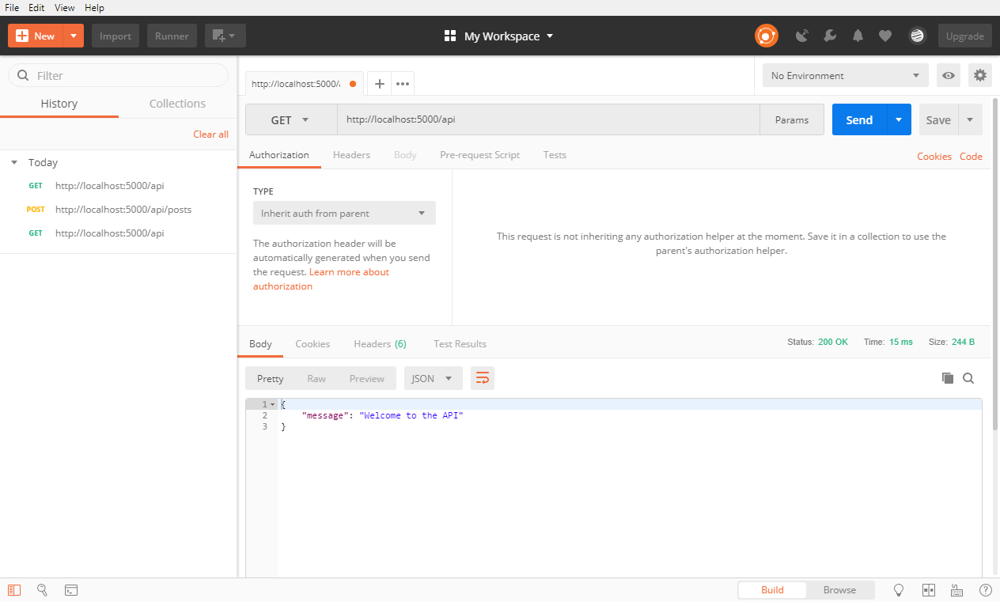

/api/posts

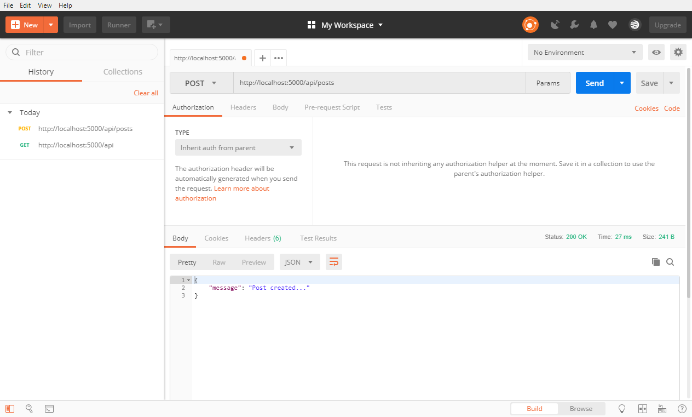

/api/login

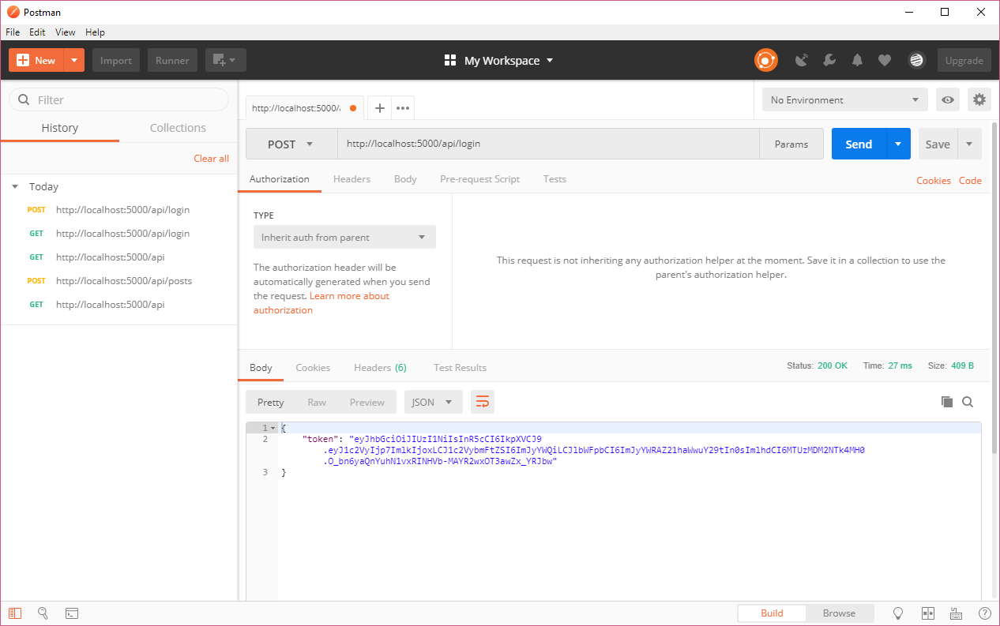

verifyToken

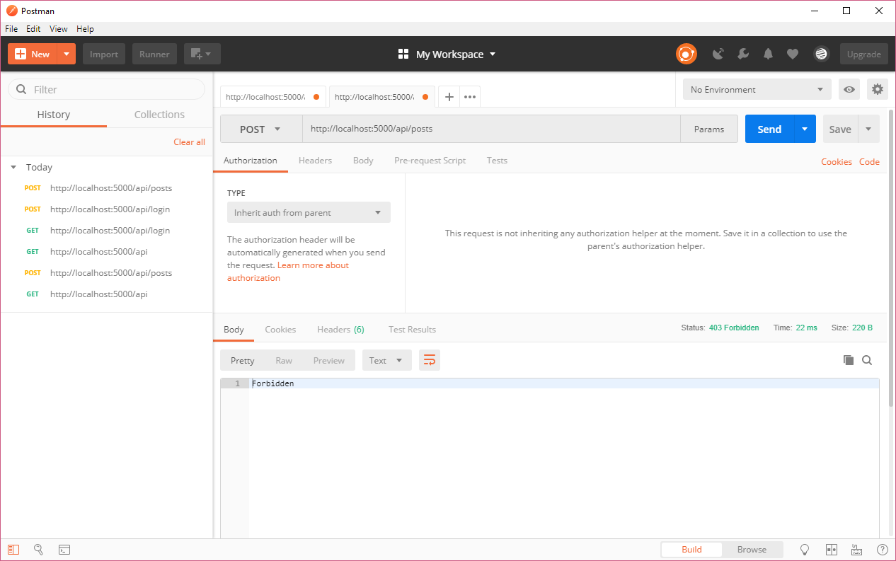

带 authorization

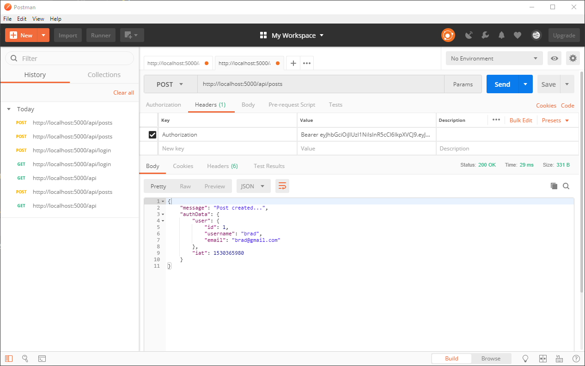

无 authorization

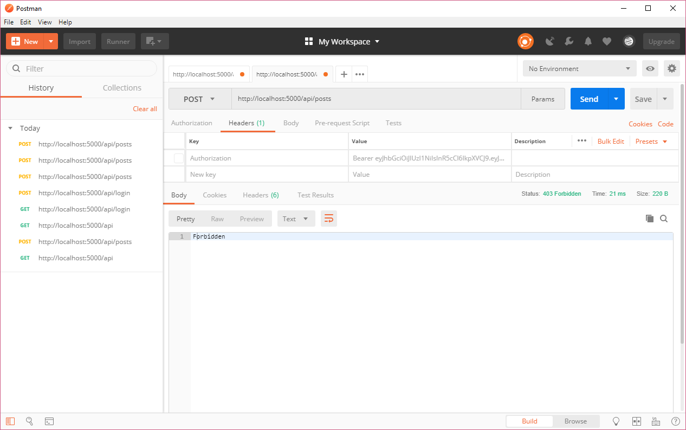

不对称

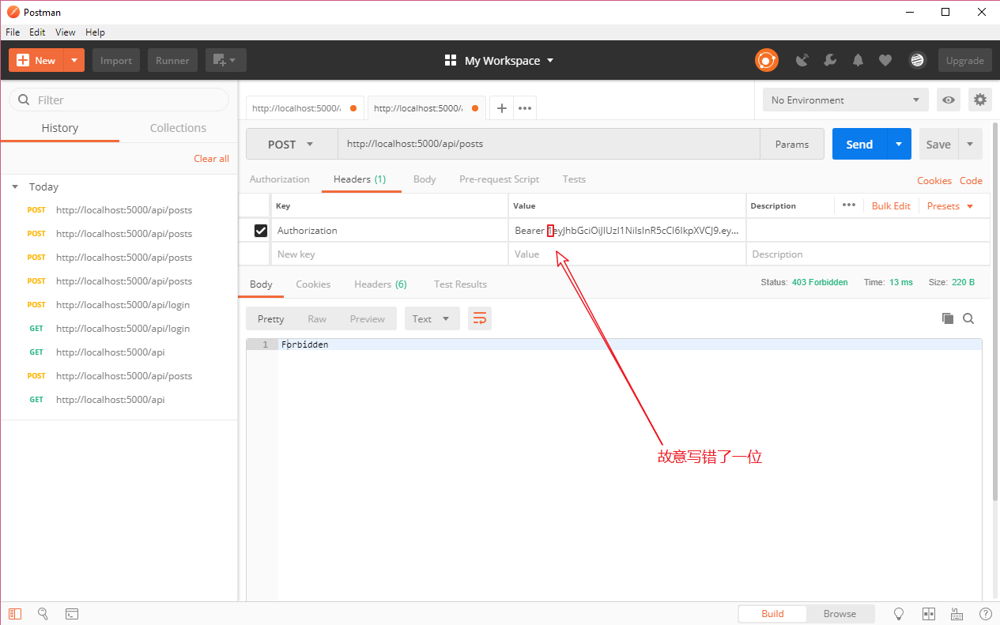

未过期

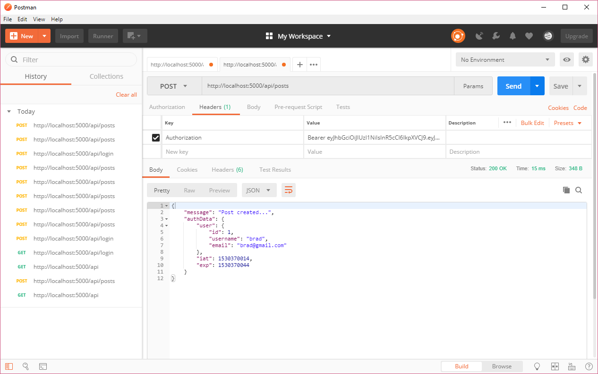

过期

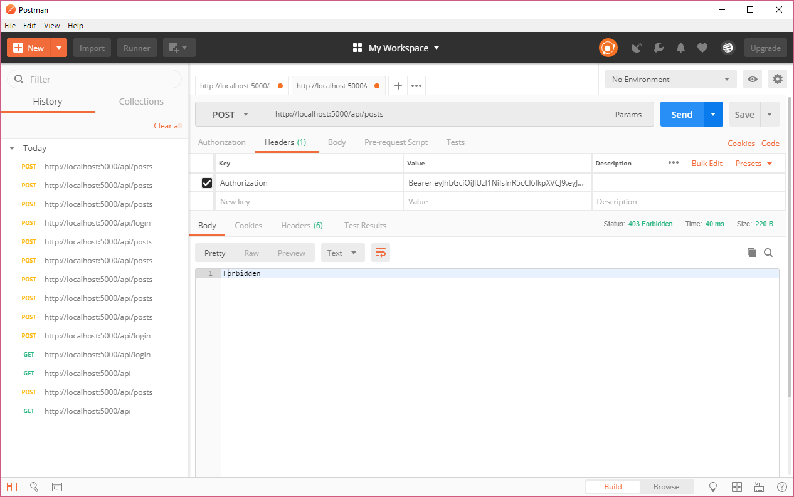

JWT

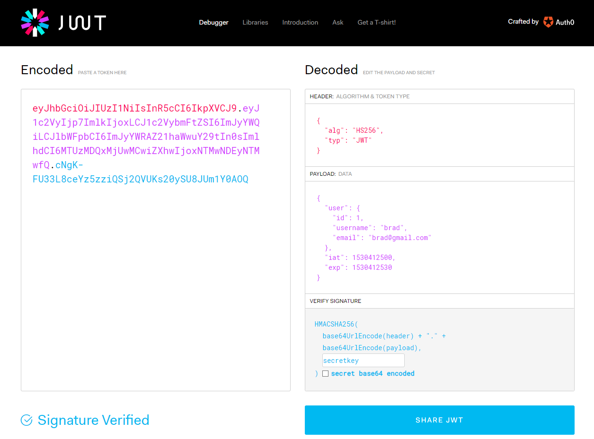

JWT Signature Verify

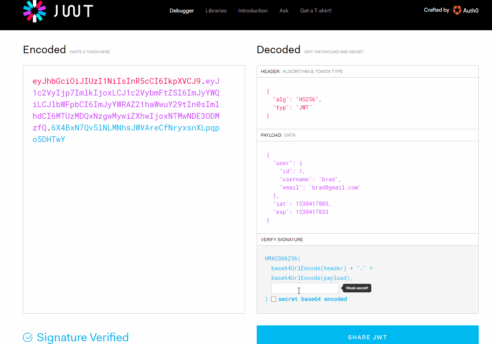

JWT 会引起 SIGNATURE 发生改变的因素 HEADER、PAYLOAD、密钥

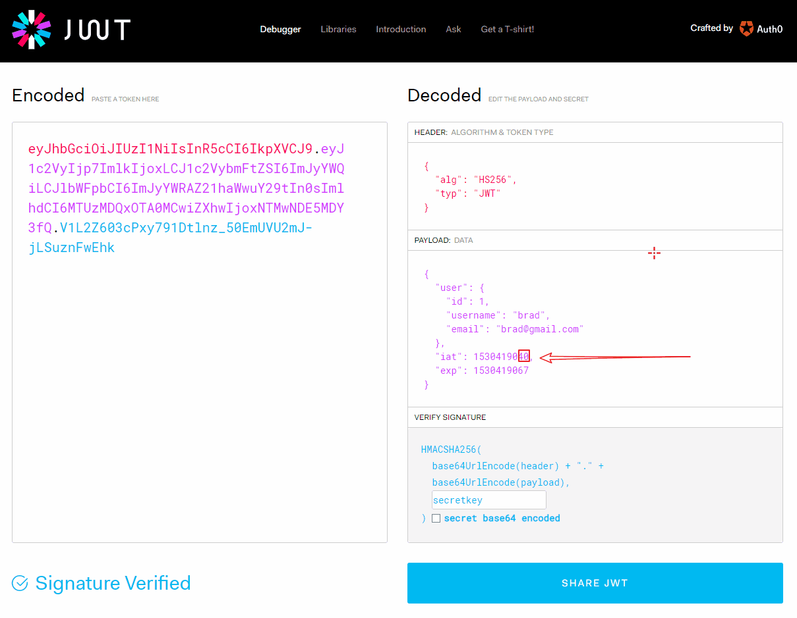

JWT Header、Loader、Signature 详细说明

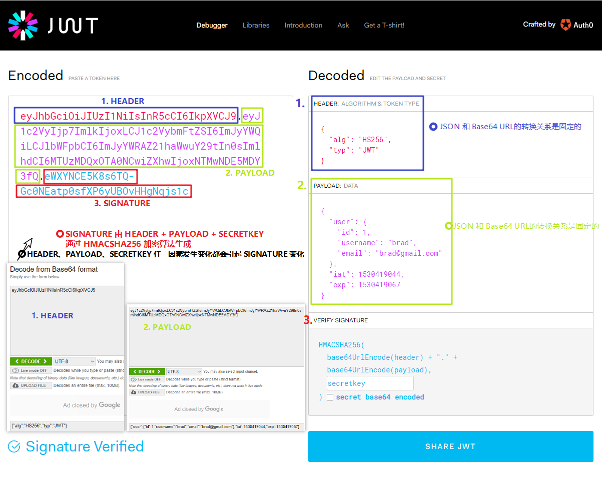